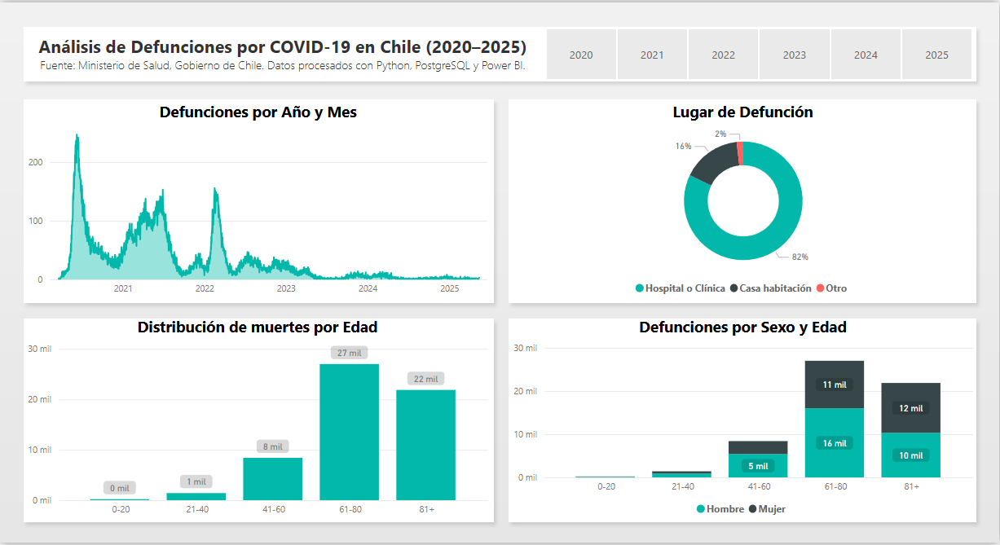
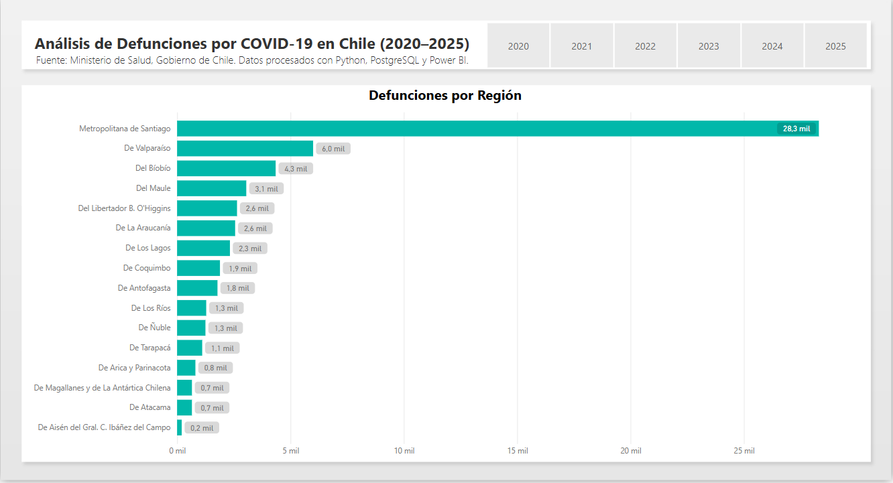

# 📊 Análisis de Defunciones por COVID-19 en Chile (2020–2025)

Este proyecto tiene como objetivo procesar, transformar y visualizar datos de defunciones por COVID-19 en Chile, utilizando herramientas de ingeniería de datos y visualización como Python, PostgreSQL, Docker y Power BI.

---

## 🧱 Estructura del Proyecto

| Componente | Tecnología | Descripción |
|------------|------------|-------------|
| ETL        | Python + Pandas | Extracción y transformación de datos desde CSV |
| Carga      | PostgreSQL (Docker) | Inserción de datos estructurados en una base relacional |
| Visualización | Power BI | Exploración visual de la mortalidad por edad, región, sexo y lugar de defunción |
| Infraestructura | Docker | Contenedor de base de datos PostgreSQL |

---

## 📂 Archivos principales

- `scripts/ETL.py`: Script que realiza todo el proceso ETL.
- `docker/docker-compose.yml`: Define el contenedor PostgreSQL.
- `reports/reporte_defunciones.pbix`: Visualización interactiva en Power BI.
- `images/`: Capturas de dashboards en Power BI.

---

## 🔍 Visualizaciones destacadas

### 📈 Defunciones por Año y Mes


### 👥 Defunciones por Edad y Sexo


---

## ▶️ ¿Cómo ejecutar este proyecto?

1. Clona este repositorio.
2. Ejecuta el contenedor de PostgreSQL:
   ```bash
   docker-compose -f docker/docker-compose.yml up -d
3. Ejecuta el script de "ETL.py"
4. Puedes abrir el archivo de power bi, o conectarte a la base de datos de postgresql local.
